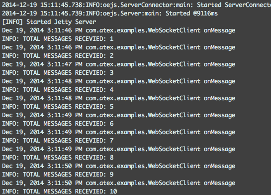

# Web Socket Client WAR scaffold
Minimal Maven scaffold for trying out web applications as web socket clients. Based on the
Maven [Standard Directory Layout](http://maven.apache.org/guides/introduction/introduction-to-the-standard-directory-layout.html)

Includes embedded
[Maven Jetty plugin](http://www.eclipse.org/jetty/documentation/9.2.2.v20140723/jetty-maven-plugin.html)
(hot reload on per default).

Build status: [](https://travis-ci.org/aweijnitz/WebSocketClient)

## Installation
- Clone this repo
- ```mvn clean install```

## Running
```mvn jetty:run```

The console log should look something like this.



## Application notes
This is a plain JEE7 Web Application. At startup it creates a
websocket connection using a ServletContextListener. It passes the
class WebSocketClient as ClientEndpoint. The ClientEndpoint handles
all incoming events.

### Connection sequence
- As the WAR deploys, a ServletContextListener will be created and invoked 
- The context listener looks for a system 'env' variable and reads the corresponding properties file ('prod' is the default env) from classpath
- Once the file is read and the container is starting, the listener will connect and send a connection message to the server with some parameters (see below)
- The event handler is registered by the context listener on the websocket

### Connection parameters
_Not yet fully implemented._

Once a connection is established, the client will send a message to the server.

The message contains the following parameters
- ```id```: Just a client id, to have somethig to refer to
- ```apiKey```: A valid API key. Without this, the client will be ignored by the server
- ```msgFilter```: key-value pair used to filter messages the client is interested in (no filter = all events)
- ```channel```: The channel to listen to. Curently only one channel is available. 'clickStream', where all click events are propagated

### Replaying old events
Currently not supported.

Will most likely be an event sent by the client requesting replay from a certain timestamp.
There will be a special temporary channel for this where the client is the only subscriber. 
(Suggesting <channel>-<clientId>. Ex: _clickStream-id:12345678_)

### Files
- The start class [WebSocketAPIConnector](src/main/java/com/atex/examples/WebSocketAPIConnector.java)
- The event handler: [WebSocketClient](src/main/java/com/atex/examples/WebSocketClient.java)
- The properties file [appConf_prod.properties](src/main/resources/appConf_prod.properties)

## WebSockets?
Some startng points

- [javax.websocket](https://javaee-spec.java.net/javadocs/javax/websocket/package-summary.html)
- [javax.websocket.ClientEndpoint](https://javaee-spec.java.net/javadocs/javax/websocket/ClientEndpoint.html)
- [Small tutorial](http://java.dzone.com/articles/java-websockets-jsr-356-jetty) 
